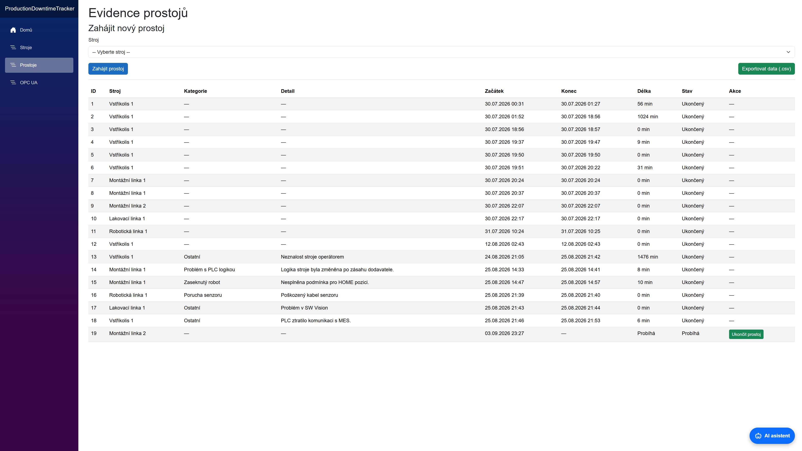
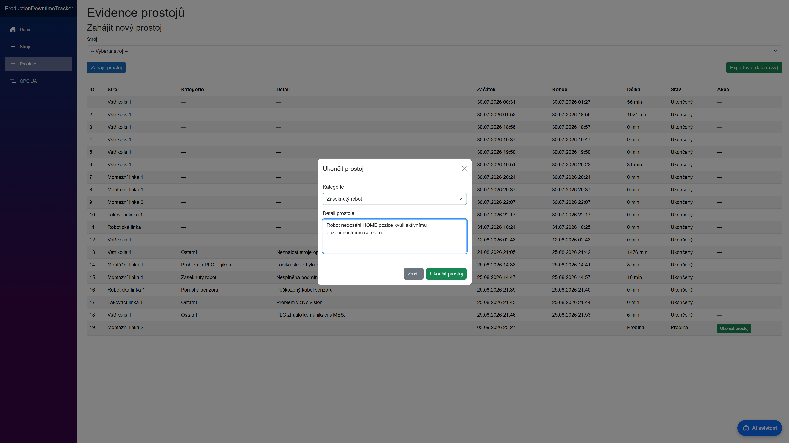
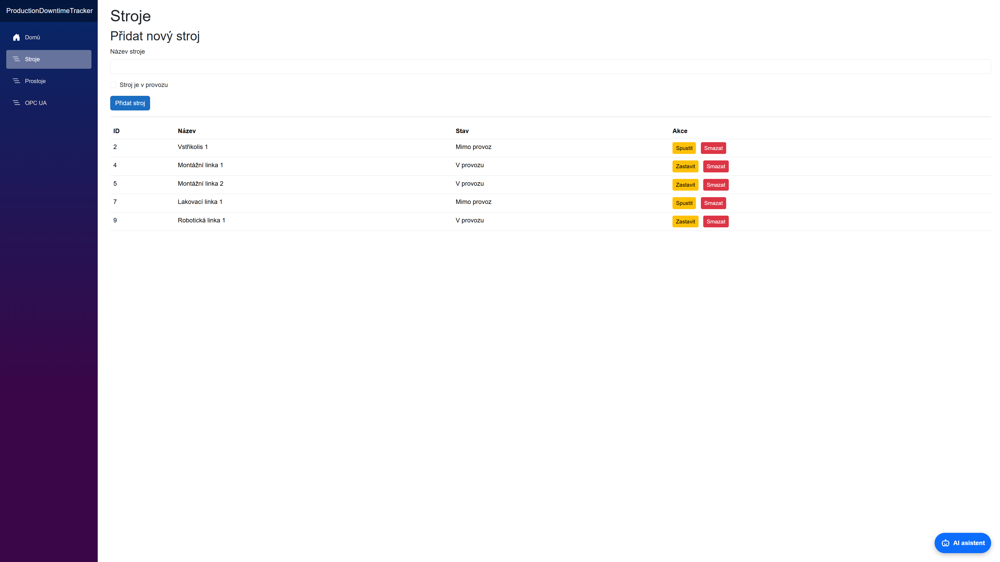
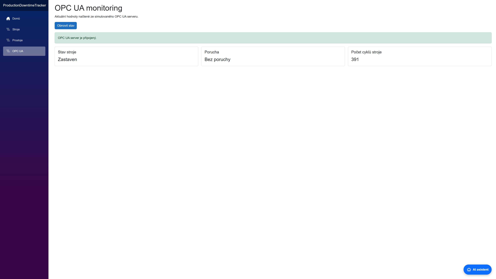
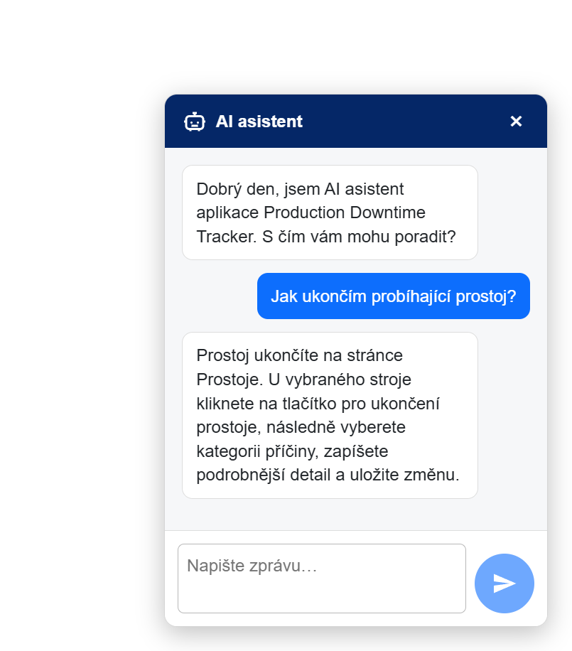

# Production Downtime Tracker

A web application for recording manufacturing lines, standalone machines, and their downtime events. It enables users to monitor equipment status, record the start and end of downtime events, classify their causes, export data, and monitor a simulated machine through OPC UA.



## Why This Project Was Created

This project is based on practical experience from a real manufacturing environment, where equipment downtime directly affects production targets and on-time deliveries to customers.

A prolonged production line stoppage can ultimately interrupt production at the customer's facility. Such situations can cause significant financial losses and contractual penalties that may increase with the duration of the interruption.

Systematic downtime tracking helps identify problematic equipment, recurring failure causes, and areas suitable for preventive maintenance. The application provides an overview of these events and creates a foundation for further analysis.

## Main Features

- managing manufacturing lines and standalone machines,
- monitoring the operational status of equipment,
- starting and ending downtime events,
- assigning a cause category and mandatory detailed description when ending a downtime,
- automatic calculation of downtime duration,
- preserving the history of completed downtime events,
- exporting recorded data to CSV,
- reading operating values from a simulated OPC UA server,
- an AI assistant for questions about using the application,
- input validation and error handling,
- REST API documentation using OpenAPI and Swagger UI.

## Technologies

- C# and .NET 10
- ASP.NET Core Web API
- Blazor WebAssembly
- Entity Framework Core
- Microsoft SQL Server LocalDB
- OPC UA
- Microsoft OPC PLC simulator
- Docker
- Google Gemini API
- OpenAPI and Swagger UI
- xUnit

## Application Architecture

The solution is divided into three projects:

- `ProductionDowntimeTracker.Client` – user interface built with Blazor WebAssembly,
- `ProductionDowntimeTracker.api` – ASP.NET Core Web API, application logic, database access, and external service integrations,
- `ProductionDowntimeTracker.Tests` – unit tests for the application logic and API.

The Blazor client communicates with the backend through a REST API. The backend uses Entity Framework Core to store data in SQL Server LocalDB and also handles communication with the OPC UA simulator and Google Gemini.

## Application Screenshots

### Ending a Downtime Event

When ending a downtime event, the user selects a cause category and enters a mandatory detailed description.



### Manufacturing Equipment Management



### OPC UA Monitoring

The application acts as an OPC UA client and reads operating data from a simulated machine. In a real manufacturing environment, similar communication can take place between a higher-level system and a PLC or the OPC UA server of a production machine.

Because the project is not connected to physical manufacturing equipment, the data source is simulated using Microsoft OPC PLC running in a Docker container.



### AI Assistant

The AI assistant answers questions about using the application and maintains the context of the previous conversation.



## Prerequisites

- .NET 10 SDK
- Visual Studio or another IDE supporting .NET 10
- Microsoft SQL Server LocalDB
- Docker Desktop for the OPC UA simulator
- a personal Gemini API key for the AI assistant

OPC UA monitoring and the AI assistant are separate integrations. The core machine and downtime tracking features can operate without configuring them.

## Installation

Clone the repository:

```bash
git clone https://github.com/michal-benko/ProductionDowntimeTracker.git
cd ProductionDowntimeTracker
```

Restore the NuGet packages and build the solution:

```bash
dotnet restore
dotnet build
```

If the Entity Framework Core command-line tool is not installed, install it using:

```bash
dotnet tool install --global dotnet-ef
```

Create or update the local database:

```bash
dotnet ef database update --project ProductionDowntimeTracker.api --startup-project ProductionDowntimeTracker.api
```

The default configuration uses SQL Server LocalDB and the `ProductionDowntimeTrackerDb` database.

## AI Assistant Configuration

The AI assistant uses Google Gemini. Each user must create their own API key in [Google AI Studio](https://aistudio.google.com/app/apikey).

Store the API key using .NET User Secrets:

```bash
dotnet user-secrets set "AiAssistant:ApiKey" "YOUR_GEMINI_API_KEY" --project ProductionDowntimeTracker.api
```

User Secrets are stored outside the repository on the local computer. The API key is therefore not included in the source code or Git history and must be configured separately after cloning the repository.

## Running the OPC UA Simulator

The project uses [Microsoft OPC PLC](https://github.com/Azure-Samples/iot-edge-opc-plc) to simulate the OPC UA server of a manufacturing machine.

Pull the Docker image:

```bash
docker pull mcr.microsoft.com/iotedge/opc-plc:latest
```

Run the simulator:

```bash
docker run --rm -it -p 50000:50000 --name opcplc mcr.microsoft.com/iotedge/opc-plc:latest --pn=50000 --autoaccept --sn=2 --sr=10 --st=bool --fn=1 --fr=1 --ft=uint
```

The simulator creates the values used by the application:

- `SlowBool1` – machine running status,
- `SlowBool2` – active fault status,
- `FastUInt1` – produced cycle count.

The application connects to:

```text
opc.tcp://localhost:50000
```

The simulator is intended only for development and demonstration purposes. In a real manufacturing environment, the application would read data from the OPC UA server of a physical machine or PLC.

## Running the Application

Start the API in the first terminal:

```bash
dotnet run --project ProductionDowntimeTracker.api --launch-profile https
```

Start the Blazor client in a second terminal:

```bash
dotnet run --project ProductionDowntimeTracker.Client --launch-profile https
```

The application will be available at:

```text
https://localhost:7253
```

The API will run at:

```text
https://localhost:7221
```

## Tests

Run the unit tests from the repository root:

```bash
dotnet test
```

The project currently contains 17 unit tests.

## Important Design Decisions

Completed downtime records cannot be deleted through the application. This is intentional to preserve production history and the traceability of recorded events.

Older records created before category and detail tracking was introduced were retained during the database model update. Therefore, these fields may be empty in historical records.

## Author

Michal Benko  
[GitHub](https://github.com/michal-benko)